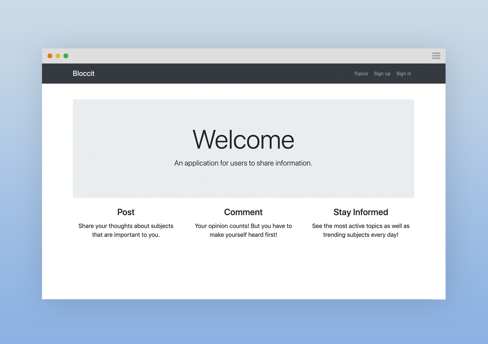

# Dang-it

A Reddit-like Node application where users can create topics, posts, and comments as well as vote and favorite posts.

[Demo](https://dang-it.herokuapp.com/) - _Allow a few seconds for the server to start up._

## Table of contents

- [General info](#general-info)
- [Screenshots](#screenshots)
- [Technologies](#technologies)
- [Setup](#setup)
- [Features](#features)
- [Todo](#todo)
- [Status](#status)
- [Contact](#contact)

## General Info

This is a personal project to understand the relationship of Node, Postgres, Sequelize, and Jasmine.

## Screenshots

## Technologies

- Node 10.16.0
- Express 4.16.4

## Setup

### `npm start`

Runs the app in the development mode. 
Open [http://localhost:3000](http://localhost:3000) to view it in the browser.

## Features

- Express routing
- CRUD on 'Topic' resource
- CRUD on 'Post' resource
- Data Validation
- User Authentication
- User commenting on posts
- User voting on posts
- User favoriting on posts
- Public profiles

## Todo

## Status

- _complete_

## Contact

- by [@taidang](https://dangarts.com) - feel free to contact me!
